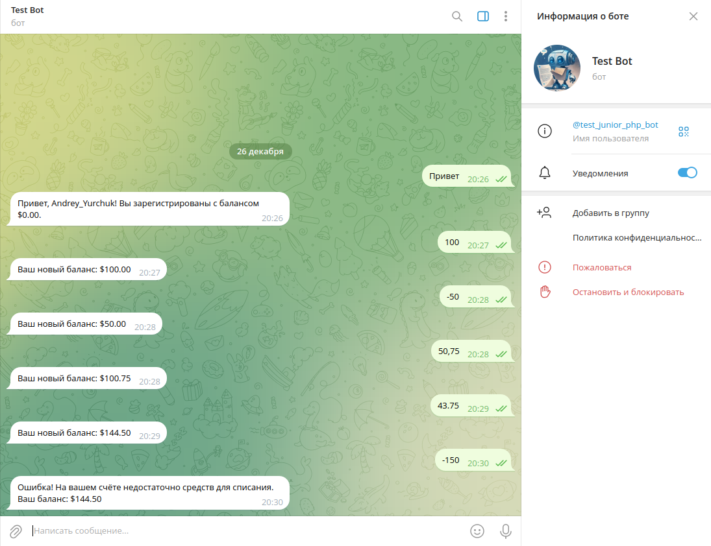

# Telegram Bot на PHP 


## Стек технологий:

- **Backend**: PHP 8.1
- **База данных**: MySQL 8.0
- **Веб-сервер**: Nginx
- **Контейнеризация**: Docker, Docker Compose
- **Туннелирование**: Ngrok

При написании Telegram бота была использована нативная php-обертка [PHP Telegram Bot API](https://github.com/TelegramBot/Api?tab=readme-ov-file).

## Описание функционала:

- **Учёт пользователей**: Когда пользователь пишет боту в первый раз, его учётная запись создается в базе данных с балансом $0.00. При последующих обращениях бот ассоциирует его с ранее созданной записью.
- **Управление балансом**: Если пользователь отправляет боту сообщение с числом, это число используется для изменения его баланса:
  - Если число положительное, сумма добавляется на его счёт.
  - Если число отрицательное, сумма списывается с его счёта, если баланс позволяет.
  - Если пользователь пытается списать больше, чем у него есть, бот возвращает сообщение об ошибке.
- **Формат чисел**: Бот поддерживает числа с разделением дробной части как точкой, так и запятой.
- **Сообщение об остатке**: После каждого изменения баланса бот отправляет пользователю сообщение с текущим остатком на его счёте.
- **Предотвращение отрицательного баланса**: Баланс пользователя не может быть отрицательным. Если пользователь пытается списать больше, чем есть на счёте, бот отправляет сообщение об ошибке.

## Установка проекта

### 1. Клонирование репозитория

Сначала клонируйте проект на свою локальную машину:

```bash
git clone https://github.com/Andrey-Yurchuk/telegram-bot-native-php.git
```
Перейдите в директорию проекта:

```bash
cd telegram_bot_native_php
```

### 2. Сборка и запуск Docker-контейнеров

Используйте Docker Compose для сборки и запуска контейнеров:

```bash
docker-compose build
docker-compose up -d
```
После сборки и запуска должны работать следующие контейнеры:
- PHP
- MySQL
- Nginx
- Ngrok

### 3. Установка зависимостей

После того как контейнеры будут запущены, выполните команду для установки зависимостей через Composer:

```bash
docker-compose run composer install
```

### 4. Настройка базы данных MySQL

Подключитесь к контейнеру MySQL и настройте базу данных:

```bash
docker-compose exec mysql mysql -u root -p
``` 
После входа создайте базу данных и таблицу:

```bash
CREATE DATABASE telegram_bot_native_php;
USE telegram_bot_native_php;

CREATE TABLE users (
    id INT AUTO_INCREMENT PRIMARY KEY,
    telegram_id BIGINT UNIQUE NOT NULL,
    username VARCHAR(255),
    balance DECIMAL(10, 2) DEFAULT 0.00
);
```

### 5. Настройка файла .env

Скопируйте файл .env.example для создания конфигурации .env:

```bash
cp .env.example .env
``` 
Затем обновите файл .env, указав ваши данные: 

```bash
APP_NAME=telegram-bot-native-php

MYSQL_ROOT_PASSWORD=<ваш_пароль_рут_БД>
DB_HOST=mysql
DB_DATABASE=telegram_bot_native_php
DB_USERNAME=<ваше_имя_пользователя_БД>
DB_PASSWORD=<ваш_пароль_БД>

NGROK_AUTH=<ваш_токен_аутентификации>

TELEGRAM_BOT_TOKEN=<ваш_токен_бота>
```
Для получения `NGROK_AUTH` перейдите на сайт [ngrok](https://ngrok.com) и создайте учетную запись или войдите в существующую.
После входа в систему перейдите в свою панель управления (dashboard). Найдите раздел "Your Authtoken" и скопируйте токен

Для получения `TELEGRAM_BOT_TOKEN` введите в поиске Telegram @BotFather. Для создания нового бота введите команду /start,
затем используйте команду /newbot. Вам будет предложено ввести имя и юзернейм для вашего бота (юзернейм должен заканчиваться на _bot).
Получите токен. После успешного создания бота BotFather предоставит вам уникальный API токен, который нужно скопировать 

### 6. Получение временного домена ngrok

Далее перейдите по адресу http://127.0.0.1:4040, чтобы получить временный домен ngrok (например, он может выглядеть вот так:
https://2693-212-129-37-129.ngrok-free.app). 

### 7. Установка вебхука

После получения временного домена ngrok необходимо установить вебхук. Для этого выполните нижеуказанную команду,
где `<ваш_токен_бота>` это значение `TELEGRAM_BOT_TOKEN`, `<ваш_токен_аутентификации>` это значение `NGROK_AUTH`:

```bash
curl -X GET "https://api.telegram.org/bot<ваш_токен_бота>/setWebhook?url=<ваш_токен_аутентификации>/webhook.php" 
```
После выполнения этой команды ваш вебхук будет настроен, и ваш бот будет готов к обработке входящих сообщений.

⚠️ Временный домен ngrok изменяется при перезапуске контейнеров Docker (или перезапуске контейнера ngrok). 
После перезапуска контейнеров необходимо по-новому пройти пункты 6 и 7 (получение временного домена ngrok и установка вебхука) 
на новый полученный адрес ngrok. 

### Скриншот Telegram бота



_На скриншоте выше показан пользовательский интерфейс приложения Telegram бота_
